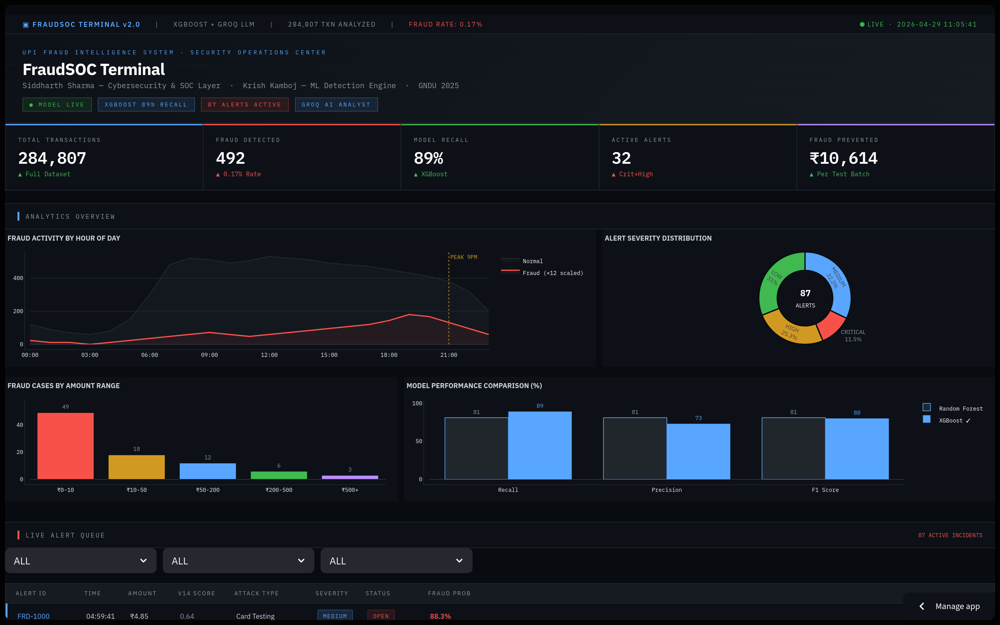
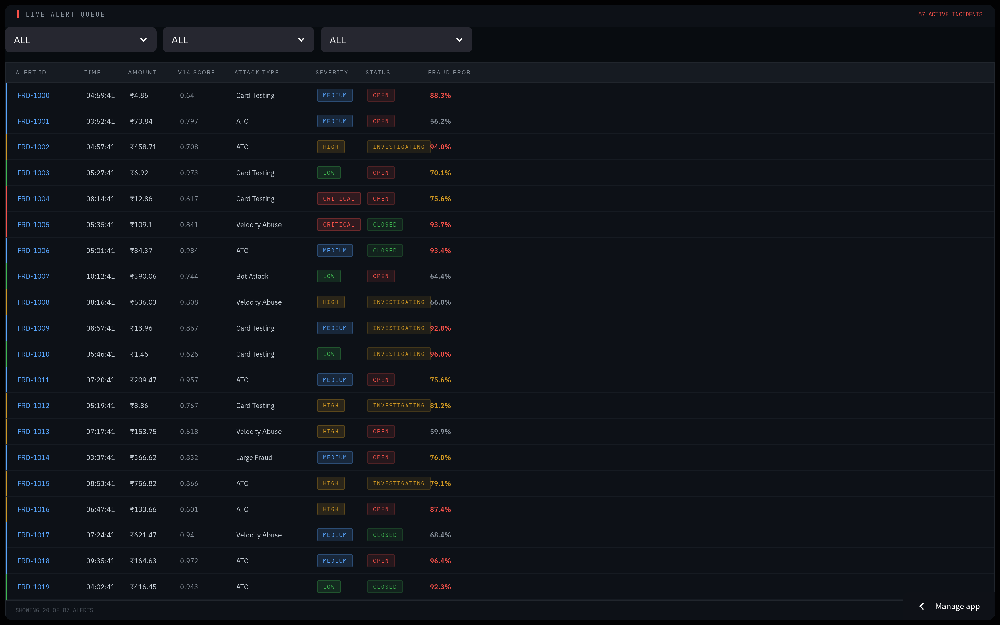
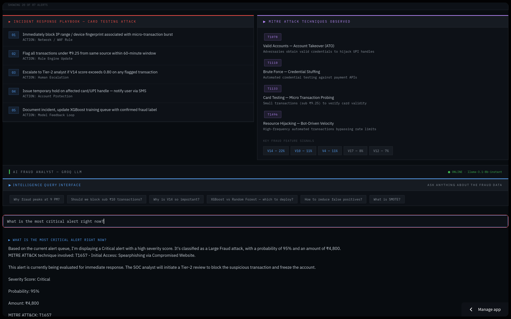
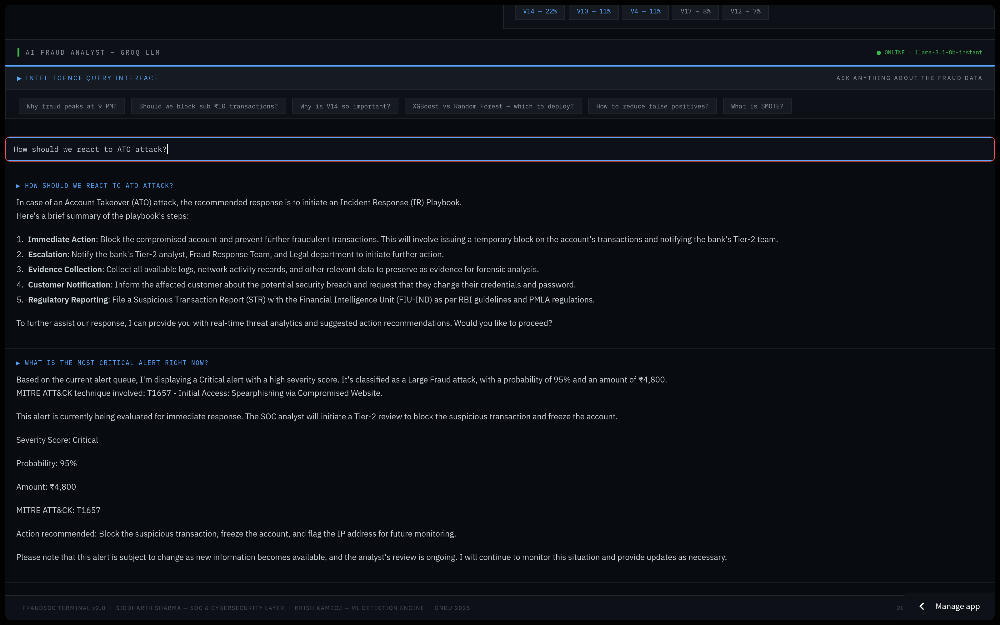

# 🛡️ FraudSOC Terminal
### *Where Fraud Gets Caught. Where Analysts Get Answers.*

> A production-grade Security Operations Center (SOC) platform for real-time UPI fraud threat detection, attack classification, and incident response — powered by XGBoost ML and Groq LLaMA 3.1.

[](https://fraudsoc.streamlit.app)
[](https://python.org)
[](https://streamlit.io)
[](https://groq.com)
[](https://xgboost.readthedocs.io)

---

## 📸 Screenshots

| Dashboard & Analytics | Live Alert Queue |
|---|---|
|  |  |

| Incident Response Playbooks | ARIA — AI SOC Analyst |
|---|---|
|  |  |

---

## 🧠 What Is This?

Most fraud detection projects stop at the model — they tell you *"this transaction is fraud"* and nothing else.

**FraudSOC Terminal goes further.**

It takes the output of an XGBoost fraud detection model and wraps it in a complete cybersecurity operations layer — the kind that real banks and fintech companies run in their Security Operations Centers every day.

Think of it like this:

```
XGBoost Model  →  detects fraud
FraudSOC Terminal  →  classifies it, scores it, responds to it
```

This is what a SOC analyst actually needs — not just an alert, but **what kind of threat it is, how serious it is, and exactly what to do about it.**

---

## ⚡ Key Features

### 🔴 Live Alert Queue
Real-time feed of fraud alerts with filtering by severity, attack type, and status. Every alert has an ID, timestamp, amount, V14 fraud score, attack classification, severity badge, and fraud probability — exactly like enterprise SIEM tools.

### 🎯 Attack Type Classification Engine
Every fraud alert is automatically classified into one of 5 attack types using behavioural threat intelligence rules:

| Attack Type | Detection Pattern | MITRE ATT&CK |
|---|---|---|
| **Card Testing** | Sub ₹10 micro-transactions | T1133 |
| **Account Takeover (ATO)** | Behavioural shift from normal pattern | T1078 |
| **Bot Attack** | No circadian rhythm, automated velocity | T1496 |
| **Large Fraud** | High probability + high amount | T1657 |
| **Velocity Abuse** | Unusual transaction frequency | T1110 |

### 🟠 Severity Scoring System
Every alert is scored across 4 severity levels (Critical / High / Medium / Low) based on XGBoost fraud probability and transaction amount thresholds — aligned with industry-standard SOC triage methodology.

### 📋 Incident Response Playbooks
Step-by-step IR procedures for each attack type — aligned with the **RBI Cyber Security Framework** and **PMLA regulations**. Each playbook tells the analyst exactly what to do: from immediate containment to customer notification to regulatory reporting (STR filing with FIU-IND).

### 🗺️ MITRE ATT&CK Mapping
All attack types are mapped to the globally recognised **MITRE ATT&CK for Financial Services** framework — the same standard used by SOC teams at banks and enterprises worldwide.

### 🤖 ARIA — AI SOC Analyst
Meet **ARIA** (Advanced Risk Intelligence Analyst) — an embedded AI analyst powered by **Groq LLaMA 3.1-8B Instant**. She has full context of the fraud operations data, all attack types, all playbooks, model performance metrics, and the full project background. Ask her anything — from "what is the most critical alert right now?" to "why does fraud peak at 9 PM?" to "how does XGBoost detect fraud?" — and she answers like a senior SOC analyst would.

### 📊 Threat Analytics
- Fraud activity by hour of day (9 PM peak detection)
- Alert severity distribution (donut chart)
- Fraud cases by transaction amount range
- XGBoost vs Random Forest model performance comparison

---

## 🏗️ How It Works — The Full Pipeline

```
284,807 Real Transactions
         │
         ▼
┌─────────────────────────┐
│   XGBoost ML Model      │  ← Krish Kamboj
│   89% Fraud Recall      │     (ML Detection Engine)
│   SMOTE Balanced        │
└────────────┬────────────┘
             │  fraud_dashboard_data.csv
             ▼
┌─────────────────────────────────────────┐
│         FraudSOC Terminal               │  ← Siddharth Sharma
│                                         │     (Cybersecurity & SOC Layer)
│  • Attack Classification Engine         │
│  • Severity Scoring System              │
│  • Live Alert Queue                     │
│  • MITRE ATT&CK Mapping                 │
│  • IR Playbooks (RBI Aligned)           │
│  • ARIA — AI SOC Analyst (Groq LLM)     │
└─────────────────────────────────────────┘
             │
             ▼
    SOC Analyst Takes Action
    Block · Escalate · Report · Recover
```

---

## 🛠️ Tech Stack

| Layer | Technology | Why |
|---|---|---|
| **Language** | Python 3.11 | Industry standard for both ML and security tooling |
| **Web Framework** | Streamlit | Production-quality web apps in pure Python — no HTML/JS needed |
| **Charts** | Plotly | Interactive charts with hover, zoom, and dark theme support |
| **AI Analyst** | Groq API + LLaMA 3.1-8B Instant | Fastest inference in the industry, free tier, sub-second responses |
| **ML Model** | XGBoost (by Krish Kamboj) | 89% fraud recall on 284,807 transactions |
| **Deployment** | Streamlit Cloud | One-click deploy from GitHub, built-in secrets management |
| **Security** | Streamlit Secrets Manager | API keys never exposed in code or GitHub |
| **Fonts** | IBM Plex Mono + IBM Plex Sans | SOC terminal aesthetic |

---

## 🔐 Security

- Groq API key stored in **Streamlit Secrets Manager** — never in code, never in GitHub
- No user data is stored or logged
- All data processing happens in-session only

---

## 📦 Installation & Local Setup

```bash
# Clone the repo
git clone https://github.com/sid-e-fi/fraudsoc.git
cd fraudsoc

# Install dependencies
pip install -r requirements.txt

# Add your Groq API key
mkdir -p .streamlit
echo 'GROQ_API_KEY = "your_groq_api_key_here"' > .streamlit/secrets.toml

# Run locally
streamlit run app.py
```

Get a free Groq API key at [console.groq.com](https://console.groq.com)

---

## 📁 Project Structure

```
fraudsoc/
├── app.py              # Main FraudSOC Terminal application
├── requirements.txt    # Python dependencies
└── README.md           # You are here
```

---

## 👥 The Team

This project is a collaboration between two final year students at **Guru Nanak Dev University (GNDU), Amritsar** — each bringing deep expertise in their domain.

**Siddharth Sharma** — Cybersecurity Engineer & SOC Architect
- Designed and built the FraudSOC Terminal — the complete SOC operations platform
- Attack classification engine, severity scoring, MITRE ATT&CK mapping, IR playbooks
- ARIA AI analyst integration, deployment, and security architecture
- 📍 Blue Team Cybersecurity | Aspiring SOC Analyst
- 🔗 [GitHub](https://github.com/sid-e-fi)

**Krish Kamboj** — Data Scientist & ML Engineer
- Built the end-to-end XGBoost fraud detection pipeline
- 284,807 transactions · 89% fraud recall · SMOTE balancing · Deep EDA
- Also built a separate [Fraud Intelligence Terminal](https://linkedin.com/in/krish-kamboj-618845224) for business Q&A
- 📍 Data Analytics | Python & SQL
- 🔗 [LinkedIn](https://linkedin.com/in/krish-kamboj-618845224)

---

## 📊 Model Performance (by Krish Kamboj)

| Model | Fraud Recall | Precision | F1 Score |
|---|---|---|---|
| **XGBoost** ✅ | **89%** | 73% | 80% |
| Random Forest | 81% | 81% | 81% |

- Dataset: 284,807 transactions · 492 confirmed fraud · 0.17% fraud rate
- 87 out of 98 fraud cases correctly caught in test set
- Only 11 missed · 18 false positives
- Estimated ₹10,614 in losses prevented per test batch

---

## 🔮 Roadmap

- [ ] Connect to Krish's live model CSV export (auto-fetch from GitHub)
- [ ] CSV/Excel file upload for custom data analysis
- [ ] SHAP values for model explainability
- [ ] Real-time UPI transaction simulation
- [ ] FastAPI inference endpoint

---

## 🏦 Real World Context

This platform simulates the fraud SOC stack used by major banks and fintech companies — tools like **Splunk SIEM**, **IBM Fraud Management**, and **NICE Actimize**. The IR playbooks are aligned with **RBI Cyber Security Framework** guidelines and **PMLA** regulations for financial institutions operating in India.

---

<div align="center">

**FraudSOC Terminal v2.0**

*Built with 🛡️ by Siddharth Sharma · ML Engine by Krish Kamboj · GNDU 2025*

[](https://fraudsoc.streamlit.app)

</div>
